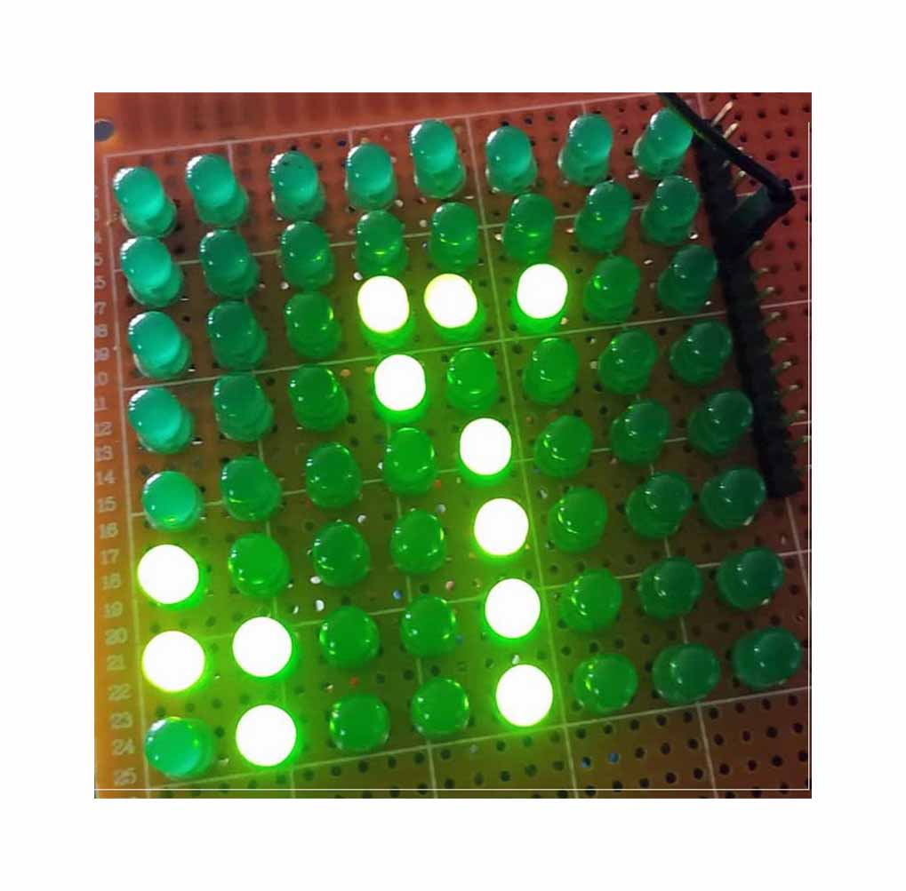

A dashboard that analyzes the sentiment of text data scraped from popular __Bangla dailies__. The dashboard
was built using __Python__ and __Django__. Scraping was done with __`BeautifulSoup`__ and __`Selenium`__. I used the
`bertweet-base-sentiment-analysis` and `gensim` to model topics.

<iframe src="/assets/img/project/sentiment.gif" width="100%" height="600px" frameborder="0">
    Your browser does not support PDFs. Please download the PDF to view it: <a href="/assets/my_pdf_file.pdf">Download PDF</a>.
</iframe>

<!-- https://github.com/shadman-shahid/shadman-shahid.github.io/blob/caca4b787f6b36c2cc4534d78e53cb4a2955aa61/assets/img/project/sentiment.gif -->
<!--    -->

